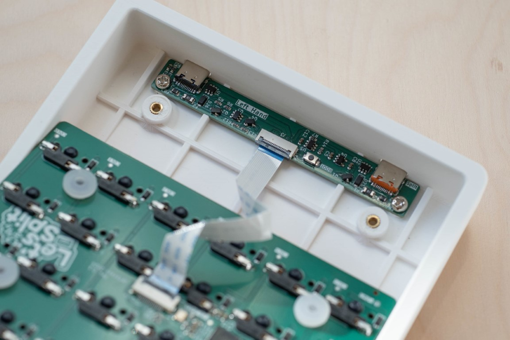
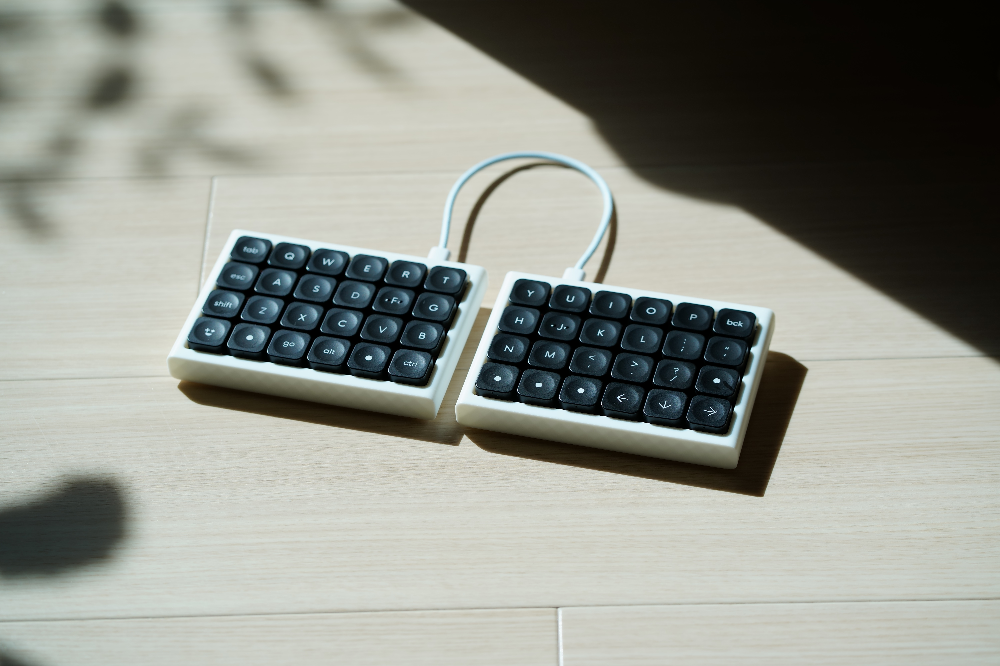
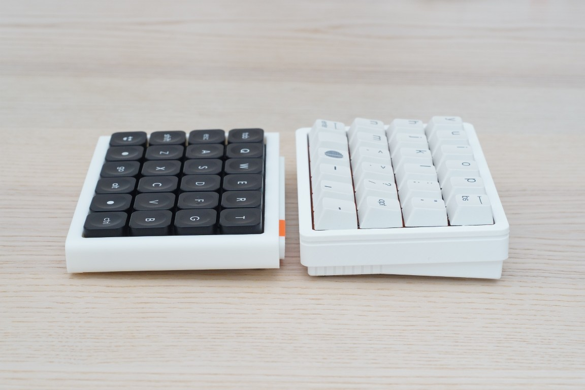

# れつぷり!! letsupuri keyboard

48キー左右分離型キーボード「Let's Split」のリメイク版。

A remake of the 48 key split keyboard "Let's Split".
Left and right connection is using USB Type-C cable. And main and power circult are separated.

- 左右間をUSB-Cケーブルで接続
- PCBはメイン基板と電源基板で分離
- シリコン製ショックアブソーバーを使ったマウント

## ビルドガイド Build Guide

- ロープロファイル版ビルドガイド(日本語版): [Low Profile Ver. Build Guide (JP)](misc/buildguide/buildguide_lowprofile_jp.md)

れつぷり!!にはCherry MX版とLow Profile版があります。ハードウェアのメイン基板はCherry MX版（PCB_main_MX）とLow Profile版（PCB_main_lowprofile）で分かれています。電源基板（PCB_power）は共通です。

"れつぷり!!" has the Cherry MX version and the Low Profile version. The main board of the hardware is divided into the Cherry MX version (PCB_main_MX) and the Low Profile version (PCB_main_lowprofile). The power supply board (PCB_power) is the same for both versions.

> [!WARNING]
> Cherry MX版のハードウェア(PCB_main_MX)は現在のところ正しく動きません。The Cherry MX version (PCB_main_MX) does not currently work properly.

## ぴくちゃ

more detail at [pekaso.org](pekaso.org)

# License
This repository contains both hardware and firmware components, each under a different license.

- `hardware/`: Licensed under the MIT License
- `firmware/`: Licensed under the GPL License (inherited from the original repository)