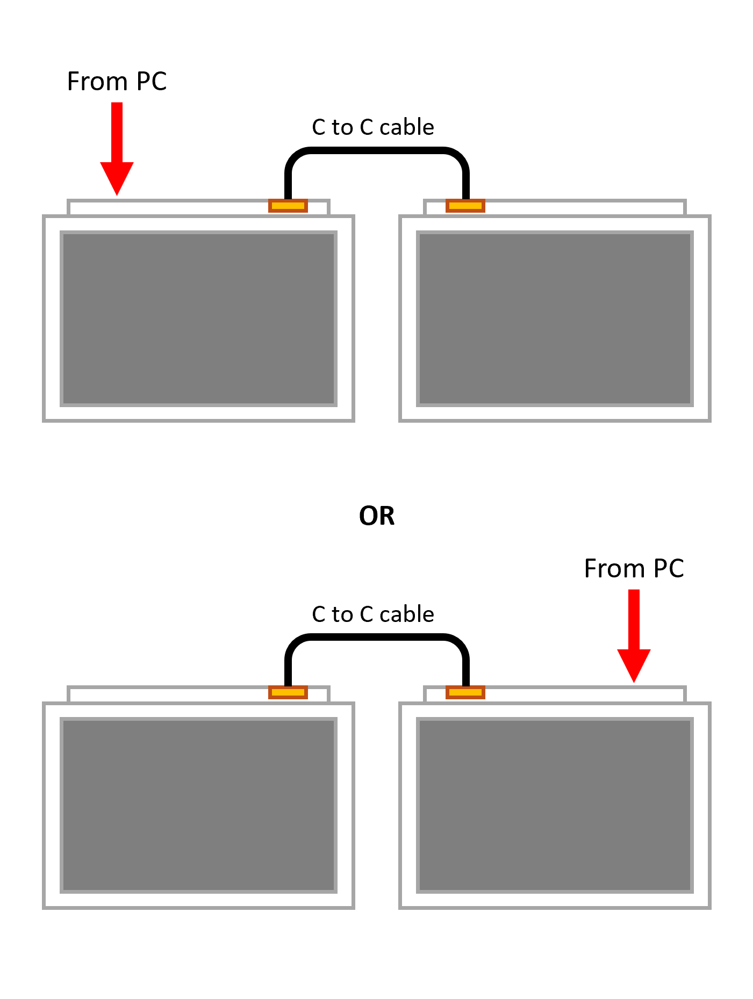

# れつぷり!! Low Profile版 キット ビルドガイド

## はじめに

キットをお選びいただきありがとうございます。
組み立て前にビルドガイドと付属品リストを確認し、不足があれば連絡先までご連絡ください。

## 付属品

| 項目 | 数量 |
|------|------|
| 3Dプリントケース（試供品） | 2組 |
| れつぷり!!基板（ケースに組込済み） | 2組 |
| プレート（ケースに組込済み） | 2個 |
| ネジ（M2x8mm, ケースに組込済み） | 8個 |
| ネジ（M3x4mm, ケースに組込済み） | 4個 |
| その他（ステッカー） | 1式 |

## 購入が必要なもの

| 項目 | 数量 |
|------|------|
| キースイッチ（Choc V1/Choc V2※1） | 48個 |
| キーキャップ（スイッチに合わせたもの） | 48個 |
| USB Type-Cケーブル（左右接続用） | 1本 |
| USB Type-Cケーブル（PC接続用） | 1本 |
| ドライバー（0番） | 1本 |
| はんだごて（オプション※2） | 1式 |
| テスター（オプション※2） | 1式 |

> [!NOTE]
> 1. Choc V2は三本足のもの（赤/茶/青）には対応しません。
> 2. 基本の組み立てには不要ですが、修理などトラブルシューティングのために持っておくことをお勧めします。

## 組立方法

### 1. PCBをケースから取り外す

ケースにPCBを留めているネジ（M2x8mm）４本をドライバーを使って取り外します。

メイン基板のPCBと電源基板はフラットケーブルで接続されているため、基板を取り外す際にはケーブルを傷めないように注意してください。

PCBを取り外したらプレートを固定しているマスキングテープを取り外してください。

### 2. キースイッチを取り付ける

PCBにキースイッチを取り付けていきます。キースイッチの向きを確認し足が曲がっていないことに注意しながら取り付けていきます。

この時、ソケットに負担が加わらないように手を添えて行うことをお勧めします。

キースイッチを取り付ける上でフラットケーブルを取り外す必要はありません。キースイッチの取付時に引っ張るなどをして傷つけないように注意してください。

### 3. 基板とプレートをケースに固定する

キースイッチを全て取り付けたら、PCBをケースに戻します。ゴムブッシュのマウントが有効に働くように、ネジは落ちないギリギリで軽く締めるようにしてください。

> [!CAUTION]
> **ネジを完全に締めてしまうとケースを貫通します。** 電動ドライバーなどは使用せず、指で軽く回しながら、少しでも重くなったときに止める程度が適切です。

### 4. キーキャップを取り付ける

キースイッチが問題なく取付することができたらキーキャップを取り付けます。これを両手分行えば完成です！

## キーボードの接続方法
れつぷり!!は左右間接続をUSB Type-C to Type-Cケーブルで行います。左右間接続を行うケーブルはケースにオレンジ色のバッジが取り付けてあるポート同士を接続してください。

PCと接続するポートは左右どちらか一方が利用できます。利用スタイルに合わせて選んでください。

## （付録）キーマップ変更方法
キーマップの変更は[Vial](https://get.vial.today/)で行うことができます。キーボードを認識させた状態でデスクトップ用ツールもしくはWeb版Vialを開くことにより、各種設定変更が可能です。

## （付録）ファームウェア書き換え方法
れつぷり!!はMCUにRP2040を使用しています。ファームウェアを書き換えるためには以下の2通りの方法でブートローダーモードに入れる必要があります。

> [!NOTE]
> れつぷり!!はテスト用にファームウェアを書き込み済みの為、基本的にファームウェアを書き換える必要はありません。

### Vialからブートローダーモードに入る方法
1. れつぷり!!をPCに接続し、Vialを開いてキーマップを編集できる状態にする

2. Vialのウィンドウ上部の"Security" -> "Reboot to Bootloader"をクリック

3. 画面の指示にしたがって、指定されたキーをプログレスバーが100%になるまで長押しする

4. れつぷり!!がブートローダーモードに入ると、WindowsであればExplorer上、MacならFinder上に"RPI-RP2"が出現する

5. ファームウェアファイル("letsupuri_vial.uf2")をRPI-RP2にドラッグアンドドロップする。自動で再起動し、キーボードとして認識します。
6. 最初にPCと繋いでいたのと反対側のポートにUSBケーブルを接続し、同じ手順を繰り返す

### BOOTボタンを押してブートローダーモードに入る方法
1. れつぷり!!のメイン基板のPCBを留めている４本のネジを外し、電源基板が見えるようにする。（メイン基板は取り外さないでください！）
2. 電源基板上にある"BOOT"と書かれたボタンを押しながら片手だけにUSBケーブルを接続する。

4. れつぷり!!がブートローダーモードに入ると、WindowsであればExplorer上、MacならFinder上に"RPI-RP2"が出現する

5. ファームウェアファイル("letsupuri_vial.uf2")をRPI-RP2にドラッグアンドドロップする。自動で再起動し、キーボードとして認識します。
6. もう一方の片手分に大して同じ手順を繰り返す
